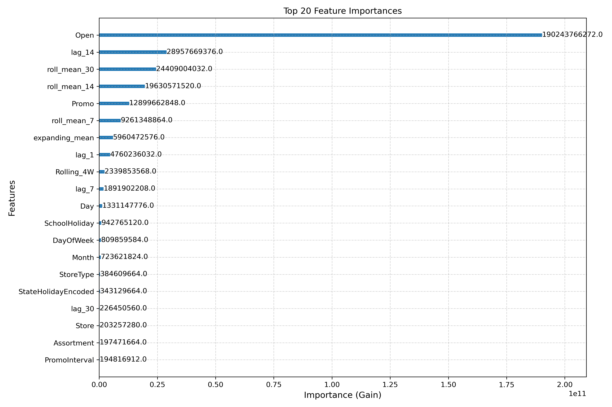
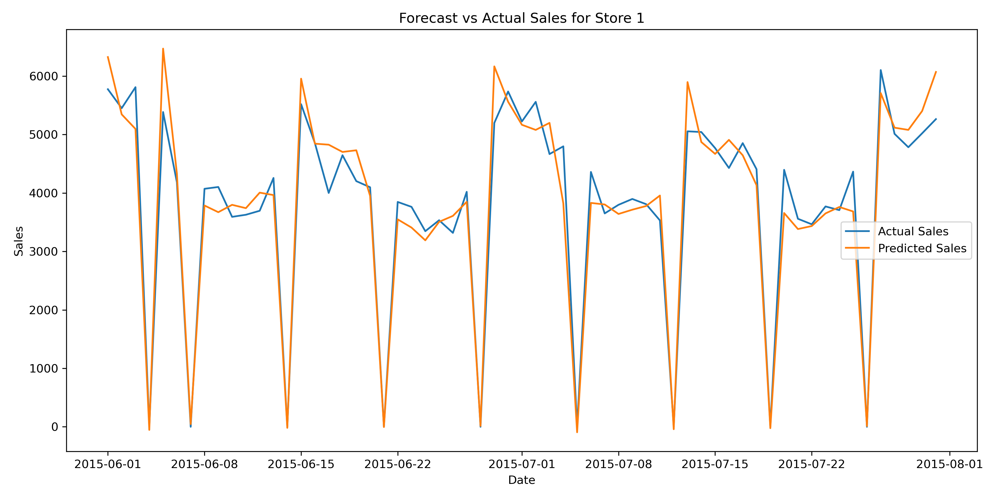

# Store-Level Weekly Sales Forecasting

## 📌 Project Overview
This project was developed during my internship at **Outsource360 Business Solutions**.  
The goal was to build a robust forecasting model to predict **weekly store-level sales** by capturing sales trends, seasonality, promotional effects, and store-specific variations.  
Such forecasts can support **demand planning, promotional strategy, and data-driven decision-making** for retail businesses.

---

## 🛠️ Data Preparation
- Merged training, test, and store datasets into a unified structure.
- Extracted time-based features: `Year`, `Month`, `Week`, `DayOfWeek`.
- Encoded categorical variables & standardized boolean flags.
- Imputed missing values and ensured dataset consistency.

---

## 🔎 Feature Engineering
- **Lag Features**: Short-term dependencies (e.g., `lag_7`, `lag_14`).
- **Rolling Averages**: Trends over 4-week & 30-day windows.
- **Promotional Flags**: `Promo2Active`, `MonthInPromoInterval`.
- **Holiday Effects**: `SchoolHoliday`, `StateHoliday`.
- **Interaction Features**: Store type × product-specific trends.
- **Competition Metrics**: `CompetitionOpenMonths`, distance-based flags.
- **Expanding Metrics**: Long-term performance via expanding mean.

---

## 🤖 Modeling Approach
- Implemented **XGBoost** as the primary forecasting model.
- Hyperparameter tuning for performance optimization.
- Time-based validation split to simulate real-world scenarios.
- Evaluation metrics: **RMSE, MAE, MAPE**.

---

## 📊 Model Performance
- Validation **RMSE**: `811.40`  
- Validation **MAE**: `530.55`  
- Validation **MAPE**: ~2.31e+18%* (outlier-affected)

The model successfully captured:
- Sales seasonality  
- Promotional effects  
- Store-level dynamics  

---

## 🔑 Feature Importance Insights
- **Open** → Sales occur only when stores are open.  
- **lag_7, lag_14** → Past sales strongly predict future sales.  
- **roll_mean_30** → Captures sales momentum.  
- **Promo** → Promotions significantly boost sales.  
- **expanding_mean** → Long-term store performance.  
- **SchoolHoliday, DayOfWeek** → Calendar effects shape sales.  

---

## 📈 Visualizations
- **Feature Importance Plot**  
- **Forecast vs Actual Sales Trend**  

  
  

---

## 🚀 Business Impact
This forecasting model provides a reliable foundation for **store-level demand prediction**.  
It enables:
- Improved inventory planning  
- Optimized promotional timing  
- Better financial forecasting and resource allocation  

Future improvements may include integrating **weather, regional economics, or competitor activity** for enhanced accuracy.

---

## 📂 Deliverables
- Trained **XGBoost model**  
- Submission file: `submission.csv`  
- Visualizations (`feature_importance.png`, `forecast_vs_actual.png`)  
- Business summary  

---

👨‍💻 **Developed by:** Ajay Singh Rana  
📍 Data Analyst / Data Science Intern, Outsource360 Business Solutions
